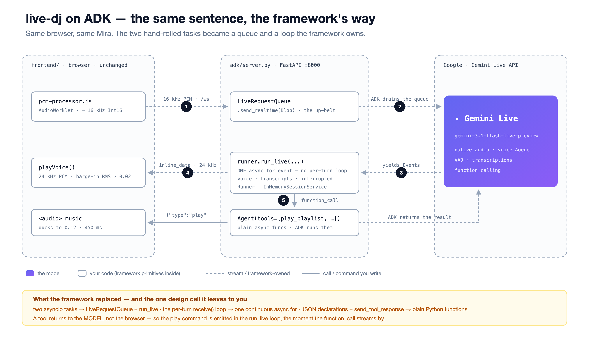

# live-dj — a voice agent you can interrupt

Talk to **Mira**, a late-night radio DJ. Ask her to play something. Talk over her mid-sentence and she stops, listens, and picks the thread back up.

Built on the **Gemini Live API** — twice. Once with the raw `google-genai` SDK so you can see the whole primitive (**EP1** of the Multimodal Agents Cookbook), and once rebuilt on **Google ADK** with the same browser and the same Mira, so you can see exactly what a framework buys you (**EP2**).


## How it works


The browser owns the audio (mic worklet down to 16 kHz, 24 kHz playback, barge-in). The server owns the socket — one `client.aio.live.connect()` session per browser, two asyncio tasks. The model owns the turn.

## The two files that matter

| File | Lines | What it is |
|---|---|---|
| [`backend/raw_minimal.py`](backend/raw_minimal.py) | **39** | The entire primitive: open a session, send the mic, receive voice, play it. Nothing else. |
| [`backend/raw_server.py`](backend/raw_server.py) | 121 | The full app — the same loop plus Mira's persona, music tools, transcripts, and barge-in. |
| [`backend/adk/`](backend/adk/) | — | **EP2:** the same app on Google ADK — `agent.py` · `tools.py` · `server.py`. Frontend and persona are shared byte-for-byte. |

Start with the minimal one. Everything that makes Mira *Mira* is the difference between the first two files. Everything the framework does for you is the difference between the second and the third.

## The gotcha — why your voice agent goes silent after one sentence

`session.receive()` is a **per-turn** async generator. It ends the moment the model finishes one reply. Iterate it once and your agent answers exactly one sentence, then never speaks again:

```python
# ❌ one reply, then silence forever
async for response in session.receive():
    ...

# ✅ a conversation
while True:
    async for response in session.receive():
        ...
```

That's the bug this repo exists to show you. A coding agent writes the first version by default. The second one is in [`raw_minimal.py`](backend/raw_minimal.py#L49).

Its sibling is in [`backend/gotcha_send_client_content.py`](backend/gotcha_send_client_content.py): mic audio goes to `send_realtime_input`, **not** `send_client_content` — get that wrong and the model simply never hears you.

## The ADK version (EP2)

Same Mira, same browser, same four tracks — only the plumbing changed. Three files in [`backend/adk/`](backend/adk/):



### What the framework replaced

| You wrote this in EP1 (raw SDK) | ADK gives you this instead |
|---|---|
| Two hand-rolled asyncio tasks (mic up / voice down) | [`LiveRequestQueue`](backend/adk/server.py) for up, [`runner.run_live()`](backend/adk/server.py) for down |
| `while True: session.receive()` — the per-turn loop you must remember | One continuous `async for event in runner.run_live(...)`. The framework owns the turns. |
| `TOOL_DECLARATIONS` as JSON + `dispatch_tool()` + a manual `send_tool_response` | Plain `async def` functions in [`tools.py`](backend/adk/tools.py). ADK reads the schema from the signature and docstring, runs the tool, and returns the result to the model. |
| You own session history | `Runner` + `InMemorySessionService` — one session per browser |

**The one design call it leaves to you:** a tool's return value goes to the *model*, not the browser. So the `{"type":"play"}` command the music player needs is emitted in the `run_live` loop, when the `function_call` streams past — see `to_play_command` in [`tools.py`](backend/adk/tools.py) and `handle()` in [`server.py`](backend/adk/server.py). Same instant-return rule as EP1: the tools never block the voice.

**Honest footnote:** ADK holds tool events while a transcription is still streaming (so transcript and action land in order). With a real microphone that's about a second — verified on `google-adk` 2.8.0 + `gemini-3.1-flash-live-preview`. In text-only tests it can look stuck. If you ever need the UI to react before the transcript settles, drive it from a `before_tool_callback` instead — that's EP3.

### Run it in `adk web` (see the framework work)

The same agent runs unchanged in ADK's dev UI — worth doing once, because every tool call shows up as an event card while Mira talks:

```bash
PYTHONPATH=. uv run adk web backend --port 8000     # open the UI, pick "adk", turn on the mic 🎙
```

- `PYTHONPATH=.` is needed because `adk web` imports the agent as `adk.agent`, and `agent.py` pulls `backend.persona` from the repo root.
- Mira keeps her voice there: Aoede is attached to the agent itself via `Gemini(speech_config=...)` in [`agent.py`](backend/adk/agent.py), not to the custom server's `RunConfig` — so it travels wherever the agent runs.
- **No music plays in adk web.** It has no `<audio>` player and no play-command bridge, so `play_playlist` fires (you'll see it in the events) and nothing happens. For the actual radio, use the custom UI above.

## Run it

```bash
uv sync
cp .env.example .env          # paste your GOOGLE_API_KEY (Gemini Developer API / AI Studio, not Vertex)

uv run uvicorn backend.raw_server:app --port 8000     # EP1 · the full DJ, raw SDK
uv run uvicorn backend.raw_minimal:app --port 8000    # EP1 · just the 39-line primitive
uv run uvicorn backend.adk.server:app --port 8000     # EP2 · the same DJ on ADK
```

Open <http://localhost:8000>, **put headphones on** (otherwise she hears her own radio), tap 🎙 and talk.

Try: *"hey Mira"* · *"can you play something dream pop"* · *"skip this"* · *"what do you think of the music?"* — then **talk over her** while she's speaking.

## What's inside

| | |
|---|---|
| `backend/raw_server.py` | the raw Gemini Live loop + music-tool dispatch |
| `backend/raw_minimal.py` | the 39-line voice-only extract |
| `backend/tools.py` | `play_playlist` / `play_track` / `skip` / `pause` — they return **instantly**, so the voice never stalls |
| `backend/persona.py` · `assets/mira_persona.txt` | who Mira is |
| `backend/gotcha_send_client_content.py` | the wrong-way/right-way example |
| `backend/adk/` | **EP2** — `agent.py` (the `Agent` + tools list) · `tools.py` (plain functions + the play-command bridge) · `server.py` (`LiveRequestQueue` + `run_live`) |
| `frontend/` | minimal browser client: 16 kHz mic worklet, 24 kHz playback, client-side barge-in, music ducking |
| `assets/tracks/` | four dream-pop tracks |
| `docs/` | the product / UX / engineering design docs + the de-risk test |

## Notes

- **Voice** is a Gemini Live *native* voice (`LIVE_VOICE`, default `Aoede`) — the Live API has its own voice set, so it can't reproduce a TTS voice you used elsewhere. The persona carries the character, not the timbre.
- **Barge-in** is client-side: the browser cuts playback the instant the mic hears you (RMS gate in `frontend/main.js`), which feels faster than waiting for the server signal. The server forwards `interrupted` too.
- **Music ducking** drops the track to 12% while Mira speaks, then brings it back.
- The four tracks and Mira's persona come from **aniradio**, a static AI-radio app of mine — the music is generated with **Lyria 3 Pro**.

## Going deeper

A second ADK live app (NOVA — voice + camera) plus a raw-SDK-vs-ADK exercise lives in [`cuppibla/multimodal-levels`](https://github.com/cuppibla/multimodal-levels) → `05-live/`.
