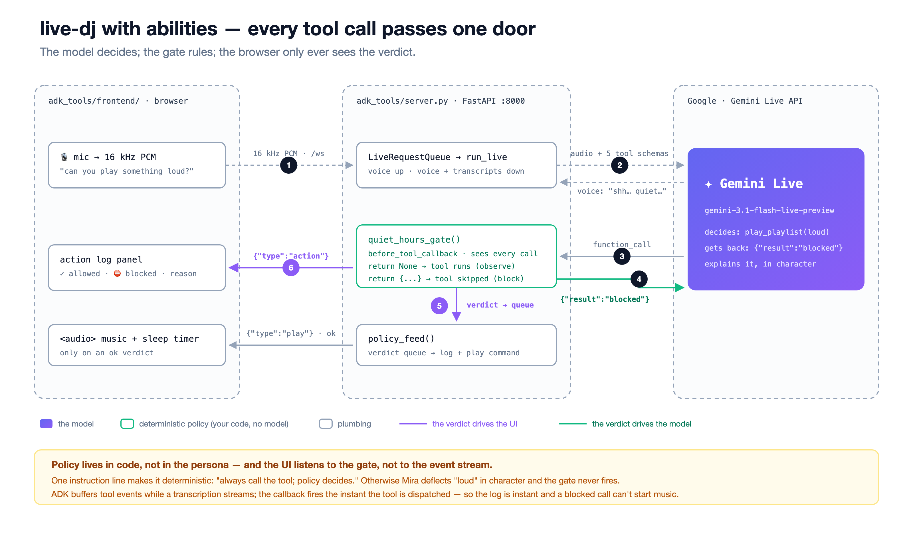

# EP3 · abilities — tools + the policy gate

Same Mira as [`../adk/`](../adk/), plus the two things a live agent needs before you can trust it with a real ability: a **new tool** she can act on mid-conversation, and **one policy door** every tool call passes through.



Three demo beats, all verified against the live model:

| You say | What happens |
|---|---|
| *"can you play something dream pop"* | `play_playlist` fires → the action log shows `✓ allowed` → music plays |
| *"can you stop the music in thirty minutes?"* | `set_sleep_timer(minutes=30)` → she confirms; a timer line appears and the track really fades out when it's due (say **"one minute"** to see it) |
| *"can you play something loud?"* (with `QUIET_HOURS=1`) | the gate **blocks** `play_playlist` → the action log shows **`⛔ blocked · quiet hours`** in red → no music, and she lets you down softly, in character |

## What's new vs EP2

| File | What it adds |
|---|---|
| [`tools.py`](tools.py) | `set_sleep_timer(minutes)` — a plain `async def`, instant return, plus its browser command in `to_play_command` |
| [`policy.py`](policy.py) | **the policy door**: a `before_tool_callback` that sees every call. `return None` = observe (the tool runs). `return {...}` = **block** — ADK skips the tool and hands that dict to the model as the result, so Mira explains the refusal herself. Every verdict is pushed to a queue the UI drains. |
| [`agent.py`](agent.py) | `before_tool_callback=quiet_hours_gate`, a fifth tool, and one instruction line that matters: *always call the tool; policy decides, not you* |
| [`server.py`](server.py) | `policy_feed()` — the browser's action log **and** its play commands are driven from the gate's verdicts, not from `run_live` events |
| [`frontend/`](frontend/) | its own copy of the shared UI + an **action log** panel (every call, its verdict, blocked in red), a sleep-timer line, and a real fade-out |

## Why the bridge moved off the event stream (the honest part)

EP2 emitted the play command when the `function_call` streamed past in `run_live`. That works with a real microphone — but ADK **buffers tool events while a transcription is still streaming**, so a UI that waits for them can react late. The gate has no such delay: `before_tool_callback` fires the instant the tool is dispatched. Routing the action log *and* the play commands through it does two things at once: the UI is instant, and a blocked call physically cannot start music — the command only exists if the verdict was `ok`.

The one line that makes the demo deterministic is in `agent.py`: without it, Mira sometimes deflects *"play something loud"* in persona ("how about something gentle instead?") and never attempts the tool — so the gate never fires and there is nothing to see. Telling her *"always call the tool, policy decides"* is not a hack; it is the lesson. Policy lives in code, not in the persona.

## Run it

From the repo root:

```bash
uv run uvicorn adk_tools.server:app --port 8000                  # music allowed
QUIET_HOURS=1 uv run uvicorn adk_tools.server:app --port 8000    # the "blocked" take
```

Open <http://localhost:8000>, headphones on, tap 🎙. Add `?log=0` to hide the action-log panel.

`QUIET_HOURS` is env-driven on purpose so a take never depends on the wall clock: unset = off · `1` = on · `auto` = the honest 22:00–07:00 clock.

## Pre-flight, no mic needed

```bash
uv run python adk_tools/smoke_live.py
```

Drives the three beats above through the live model with text turns and checks the verdicts and the commands the browser would receive. Expect three `PASS`.

## In `adk web`

```bash
uv run adk web . --port 8000
```

Pick **`adk_tools`**, mic on. The function_call / function_response cards show up as before — and now a **blocked** call shows a response of `{"result": "blocked", ...}` instead of `ok`. No music plays here (no player), and the action-log panel is part of this folder's frontend, not the dev UI.
