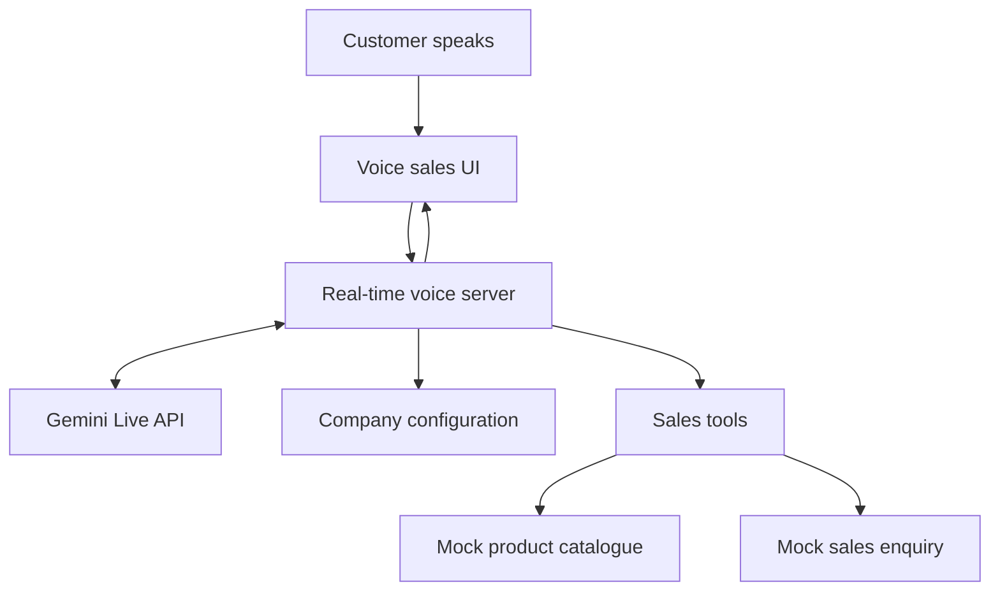

# AI Voice Sales Assistant POC — Brainstorm

## 1. Executive summary

Transform the [`cuppibla/live-dj`](https://github.com/cuppibla/live-dj) demonstration from a real-time AI radio DJ into a configurable AI voice sales assistant proof of concept.

The product itself should not be hard-coded for one company. It should provide a reusable real-time voice-sales foundation that can be configured with each customer's:

- Company identity and branding
- Product or service catalogue
- Customer segments
- Qualification process
- Sales rules and restrictions
- Available actions and integrations
- Preferred language and tone

Kittichet SPR will be the first demonstration configuration. It is a strong example because its sales process is consultative: the assistant must understand a customer's business and operating requirements before recommending cleaning, hygiene, washroom, food-service, or facility products.

The core product message is:

> A configurable AI sales representative that speaks naturally, understands customer needs, recommends suitable solutions, and hands qualified opportunities to the sales team.

For customer presentations, describe the Kittichet version as:

> A rapid proof of concept demonstrating how real-time voice AI could support Kittichet's sales consultation process.

---

## 2. Why this idea is valuable

Sales teams repeatedly spend time on the same early-stage activities:

- Asking basic qualification questions
- Explaining common product differences
- Identifying customer requirements
- Handling simple objections
- Collecting contact details
- Writing conversation summaries
- Passing incomplete information to another salesperson

The voice assistant handles this initial conversation consistently and gives the human salesperson a structured, qualified opportunity. It is not intended to replace the salesperson. It lets the salesperson enter the conversation later with better information.

The ideal customer reaction is:

> “I can imagine our customers speaking to this, and our sales team receiving a complete enquiry afterward.”

---

## 3. Starting point: `live-dj`

The original repository already demonstrates several useful foundations:

- Real-time voice conversation using the Gemini Live API
- Browser microphone capture and audio playback
- Continuous multi-turn conversation
- User interruption, or barge-in, while the AI is speaking
- Live transcripts
- Persona configuration
- Tool calling
- A minimal Python backend and browser frontend

The DJ behaviour is not a fine-tuned model. It is mainly produced by a persona prompt, music data, and music-related tools. The same foundation can therefore be adapted to a sales context by replacing those domain-specific elements.

### Conceptual replacement

| Existing DJ concept | Sales-assistant equivalent |
|---|---|
| DJ persona | Professional sales consultant |
| Music catalogue | Product or service catalogue |
| Play a track | Present or recommend a product |
| Select a playlist | Recommend a solution package |
| Skip or pause | Stop speaking or change topic |
| Track display | Product recommendation card |
| Music conversation | Sales qualification conversation |

---

## 4. Product positioning

### Working product name

**MERCIL Voice Sales Agent**

Alternative neutral names:

- AI Voice Sales Consultant
- Conversational Sales Agent
- Voice Commerce Assistant
- AI Sales Concierge

### Positioning statement

> MERCIL Voice Sales Agent is a configurable, real-time AI sales representative that learns an organization's catalogue and sales process. It speaks with prospective customers, qualifies their requirements, recommends relevant solutions, and prepares structured opportunities for the human sales team.

### What the product is not

- It is not a hard-coded Kittichet chatbot.
- It is not a scripted voice recording.
- It is not a general-purpose AI with unrestricted answers.
- It is not a replacement for specialist advice or final commercial approval.
- The first POC is not a complete CRM, quotation, stock, or order-management system.

---

## 5. Reusable product versus customer configuration

### Reusable core

The reusable product should handle:

- Real-time voice input and output
- Interruption while the AI is speaking
- Conversation history
- Live transcript
- Customer-need discovery
- Tool execution
- Recommendation presentation
- Lead qualification
- Confirmation before actions
- Conversation summary
- Human handoff

### Configurable customer layer

| Configuration area | Kittichet example |
|---|---|
| Company name | Kittichet SPR |
| Assistant role | Hygiene and facility sales consultant |
| Customer segments | Hotels, restaurants, hospitals, factories and offices |
| Knowledge | Cleaning, washroom, food-service and facility products |
| Brands | Kimberly-Clark, Ecolab, Ocean Glass, 3M, FEST, Kärcher and others |
| Qualification rules | Business type, scale, surfaces, consumption, priorities and location |
| Safety rules | Never invent prices, specifications or chemical instructions |
| Sales actions | Prepare enquiry and request a human consultant |
| Default language | Thai |
| Tone | Professional, helpful and consultative |

### Suggested configuration structure

```text
company-configs/
├── default/
│   ├── persona.txt
│   ├── products.json
│   └── sales-rules.json
├── kittichet/
│   ├── persona.txt
│   ├── products.json
│   └── sales-rules.json
└── another-customer/
    ├── persona.txt
    ├── products.json
    └── sales-rules.json
```

For the POC, the active configuration can be selected through an environment variable:

```text
COMPANY_PROFILE=kittichet
```

A customer-facing configuration portal is outside the first POC scope.

---

## 6. Kittichet demonstration configuration

Kittichet SPR distributes washroom supplies, cleaning chemicals and equipment, food packaging, glassware, kitchenware, and ice machines. Its customers include hotels, resorts, hospitals, factories, restaurants, shopping centres, offices, and government organizations. Its public company positioning emphasizes professional consultation, hygiene, sustainability, operational efficiency, safety, and organizational image.

Sources:

- [Kittichet SPR website](https://kittichet-spr.com/)
- [Kittichet SPR company profile](https://kittichet-spr.com/about-us/)

### Recommended AI role

**Kittichet AI Hygiene & Facility Sales Consultant**

The assistant should discover the customer's operational situation before recommending product categories. It should behave like a capable first-contact consultant rather than an online catalogue reader.

### Primary demo customer

A purchasing manager preparing to open an 80-room hotel in Khao Yai. The hotel includes:

- Guest rooms
- Six public washrooms
- A restaurant
- Two meeting rooms
- Housekeeping operations

The customer is interested in:

- Tissue and controlled washroom dispensers
- Housekeeping chemicals and cleaning equipment
- Restaurant glassware
- An ice machine
- Environmentally friendly food packaging

This scenario demonstrates several connected Kittichet product categories in one coherent conversation.

---

## 7. AI behaviour and reasoning

The assistant should be dynamic rather than over-fitted to a single script. The hotel conversation is a reliable presentation path, but the AI should also adapt when the customer says they operate a restaurant, hospital, factory, or office.

### Behaviour principles

1. Understand the customer's business before recommending anything.
2. Ask one relevant question at a time.
3. Adapt questions to previous answers.
4. Identify the customer's operational problem, scale, priorities, constraints, and timeline.
5. Explain why a recommendation is suitable.
6. Use catalogue tools for factual product information.
7. Clearly distinguish known facts from general recommendations.
8. Admit when information is unavailable.
9. Offer a human specialist for technical or commercial questions.
10. Confirm customer information before submitting an enquiry.

### Controlled versus dynamic behaviour

| Area | Expected behaviour |
|---|---|
| Follow-up questions | Dynamically generated using qualification guidelines |
| Understanding customer needs | Dynamic reasoning based on conversation |
| Objection handling | Dynamic, within approved boundaries |
| Product-category recommendation | Dynamic, grounded in catalogue data |
| Product specifications | Catalogue data only; never guessed |
| Price and availability | Approved data or tool result only |
| Chemical safety and usage | Approved documents or human specialist only |
| Discounts and commercial promises | Never invented or approved by the AI |
| Enquiry submission | Requires explicit customer confirmation |

### Draft system-prompt direction

```text
You are a professional AI sales consultant representing the currently
configured company.

Your objective is to understand the customer's business and operational
needs, recommend relevant solutions using approved company information,
and prepare a qualified enquiry for a human salesperson.

Ask one relevant question at a time. Adapt your questions to the customer's
industry and previous answers. Keep spoken responses concise and natural.

Recommend only products or categories returned by the product catalogue
tools. Never invent prices, availability, specifications, discounts,
certifications, or chemical safety instructions.

When information is unavailable, say so clearly and offer to connect the
customer with a specialist.

Before submitting or changing any customer information, summarize the
proposed action and ask for explicit confirmation.
```

---

## 8. Example demonstration conversation

**AI:**

> Hello, welcome to Kittichet SPR. I'm your AI sales consultant. What type of business are you purchasing products for?

**Customer:**

> We're opening a hotel in Khao Yai.

**AI:**

> Congratulations. How many rooms will the hotel have, and will it include a restaurant or conference area?

**Customer:**

> We will have 80 rooms, a restaurant, and two meeting rooms.

**AI:**

> Understood. I can help prepare recommendations for guest-room hygiene, public washrooms, housekeeping, restaurant supplies, and ice production. Which area would you like to start with?

**Customer:**

> Public washrooms.

**AI:**

> Approximately how many public washrooms will you have, and is your priority lower operating cost, premium appearance, or environmental sustainability?

**Customer:**

> Six. We want them to look premium, but we also want to control tissue usage.

**AI:**

> A controlled-dispensing washroom system may suit that requirement because it can provide a consistent appearance while reducing unnecessary consumption. Would you prefer paper towels, hand dryers, or a combination?

**Customer interrupts:**

> Wait—can you recommend cleaning products too?

**AI:**

> Certainly. To recommend the appropriate housekeeping categories, what are the main floor and surface types in the guest rooms and public areas?

After the qualification conversation, the AI summarizes:

> I've prepared a preliminary requirement summary for your 80-room hotel. It includes washroom dispensers and tissue supplies, housekeeping chemicals and equipment, restaurant glassware, sustainable food packaging, and an ice-machine consultation. May I submit this enquiry to Kittichet's sales team?

The customer confirms, and the UI displays:

> Demo enquiry KT-POC-001 has been prepared for the sales team.

The user should deliberately interrupt the assistant once during the demonstration because real-time barge-in is one of the POC's most visible differentiators.

---

## 9. Qualification information

The assistant should collect only information relevant to the current customer and industry.

### General qualification

- Customer name
- Company name
- Phone number
- Email or LINE contact
- Business type
- Location
- Number of branches or operating sites
- Business scale
- Current problem
- Priority: cost, quality, safety, sustainability, efficiency, or image
- Budget range, if the customer is willing to provide it
- Required delivery or implementation date
- Preferred human follow-up method

### Industry-specific examples

| Customer type | Relevant questions |
|---|---|
| Hotel or resort | Rooms, occupancy, public areas, washrooms, restaurant, housekeeping and guest experience |
| Restaurant | Seats, meals per day, kitchen surfaces, food packaging, cleaning frequency and ice demand |
| Hospital | Areas of use, hygiene requirements, infection-control process, safety documentation and consumption |
| Factory | Facility size, floor type, contamination, machinery, cleaning frequency and safety requirements |
| Office | Employee count, washrooms, visitor volume, pantry, consumption and workplace image |

---

## 10. Tools for the POC

### Minimum tools to implement today

```text
search_products(customer_requirement)
recommend_products(customer_profile)
create_sales_enquiry(customer_details, requirements)
```

These tools can use static mock JSON. No database or external business-system integration is required.

### Preferred tool set after the POC

- `search_product_catalog`
- `get_product_information`
- `recommend_product_categories`
- `compare_products`
- `check_service_area`
- `check_price`
- `check_availability`
- `capture_customer_information`
- `create_sales_enquiry`
- `request_human_consultant`
- `schedule_follow_up`

### Tool-design rules

- Product data should come from the catalogue, not the model's memory.
- Tool results should be structured and predictable.
- Write actions require explicit customer confirmation.
- Tool failures should produce a clear explanation and human-handoff option.
- The AI should not expose internal tool names to the customer.

---

## 11. Mock data for the first demo

Prepare approximately 15–20 products or product families across:

- Washroom dispensers
- Toilet tissue
- Paper towels
- Hand-hygiene products
- General-purpose cleaning chemicals
- Degreasers
- Disinfectant categories
- Floor-cleaning pads and equipment
- Glassware
- Food packaging
- Ice machines

Each mock entry should contain:

```json
{
  "id": "demo-product-001",
  "name": "Demo Controlled Tissue Dispenser",
  "brand": "Approved brand",
  "category": "Washroom",
  "customer_types": ["hotel", "restaurant", "office"],
  "use_cases": ["high-traffic washroom", "consumption control"],
  "benefits": ["controlled dispensing", "consistent appearance"],
  "specifications": {},
  "price_status": "contact_sales",
  "availability_status": "confirmation_required",
  "demo_only": true
}
```

Use explicit demo labels. Do not present invented product names, specifications, prices, or stock levels as real Kittichet information.

---

## 12. POC interface

The main UI should retain the simplicity of the original demo while communicating that it is a configurable sales product.

### Product identity

```text
MERCIL Voice Sales Agent
Currently representing: Kittichet SPR
```

This allows Kittichet to feel personally represented while other customers can imagine their own organization in the same position.

### Recommended UI elements

- Main microphone button
- Listening, thinking, and speaking status
- Live conversation transcript
- Current customer-requirements panel
- Recommended-product cards
- Proposed-action confirmation card
- Human-handoff button
- Completed enquiry summary
- Clear “Demonstration data” label

### UI priorities for today

1. Replace all radio and music terminology.
2. Apply neutral product branding.
3. Display “Currently representing: Kittichet SPR.”
4. Show requirement and recommendation cards.
5. Show a successful mock-enquiry result.

Avoid building an admin portal or advanced dashboard for the initial presentation.

---

## 13. Proposed architecture



The browser continues to own microphone capture, audio playback, and immediate interruption behaviour. The server manages the live AI session, loads the selected company configuration, and dispatches sales tools.

---

## 14. Scope for today's build

### Must have

- Application starts reliably with a Gemini API key
- Thai real-time voice conversation
- User can interrupt the assistant while it is speaking
- Neutral product branding
- Kittichet company configuration
- Hotel qualification scenario
- Static product catalogue
- Product-category recommendation
- Live transcript
- Customer-requirement summary
- Confirmation before enquiry submission
- Mock successful enquiry

### Nice to have

- English-language conversation
- Product recommendation cards
- Configuration switch between Kittichet and a generic company
- Human-handoff action
- Saved local transcript

### Explicitly out of scope

- Production CRM integration
- Authentication and permissions
- Real quotation generation
- Real-time stock checking
- Real customer or transaction data
- Payment or order processing
- Arbitrary discount negotiation
- Production security and compliance implementation
- Customer-facing configuration portal
- Multiple fully developed industry scenarios

---

## 15. Suggested implementation schedule

### First 30 minutes

- Preserve the original repository history and attribution.
- Request licensing permission from the author.
- Configure the Gemini API key.
- Confirm that the original voice conversation works.

### Next 60 minutes

- Replace the DJ persona with the configurable sales persona.
- Remove music-specific language.
- Add Kittichet mock catalogue data.
- Replace music tools with the three minimum sales tools.

### Next 60–90 minutes

- Apply neutral MERCIL Voice Sales Agent branding.
- Add the Kittichet configuration label.
- Display customer requirements and recommendations.
- Add the mock enquiry confirmation state.

### Final hour

- Test the complete hotel conversation.
- Rehearse one interruption.
- Check Thai recognition and pronunciation.
- Prepare typed fallback prompts.
- Record a backup video of the successful flow.
- Remove or hide incomplete controls.

---

## 16. Acceptance criteria

The first POC is successful when:

1. A customer can complete the primary conversation using voice.
2. The assistant responds in natural Thai.
3. The customer can interrupt it while it is speaking.
4. The assistant asks at least three relevant qualification questions.
5. Its next question changes based on the customer's previous answer.
6. It recommends only categories or products available in mock catalogue data.
7. It explains why a recommendation fits the stated requirement.
8. It collects enough information to prepare a qualified sales enquiry.
9. It summarizes the customer and requirements before submission.
10. It asks for explicit confirmation before creating the mock enquiry.
11. A structured enquiry result appears in the UI.
12. The main demonstration can be completed in 90 seconds to three minutes.

---

## 17. Presentation plan

### Opening

> This is a configurable AI voice sales agent. It can be provided with an organization's product catalogue, customer segments, qualification process, business rules, and brand voice.

### Introduce the configuration

> For today's demonstration, we configured it as a sales consultant for Kittichet SPR.

### Run the conversation

- Play the hotel purchasing manager.
- Provide enough information for useful recommendations.
- Interrupt the assistant once.
- Ask one question outside the expected order.
- Finish by confirming the mock enquiry.

### Explain reusability

> The real-time voice foundation remains the same. For another organization, we replace the company knowledge, qualification process, sales actions, and branding.

### Close with business value

> The AI handles repetitive initial sales conversations, while human salespeople receive qualified opportunities with complete customer requirements.

---

## 18. Risks and mitigations

| Risk | Mitigation |
|---|---|
| Thai speech recognition is inconsistent | Use a quiet room, headset, short sentences, and typed fallback prompts |
| AI invents product facts | Ground recommendations in tools and explicitly prohibit unsupported claims |
| Live API or network fails | Record a successful backup demonstration |
| Demo conversation becomes too long | Keep spoken answers short and rehearse a 90-second path |
| Assistant behaves like a script | Use adaptive qualification rules rather than fixed question order |
| Assistant becomes too general | Limit recommendations and factual claims to configured company knowledge |
| Customer assumes it is production-ready | Clearly label it as a POC using demonstration data |
| Unlicensed upstream code creates ownership risk | Preserve attribution, request permission, and replace the foundation before commercial delivery if permission is unavailable |

---

## 19. Repository ownership and licensing

The current `live-dj` repository appears not to include an explicit open-source license. A public GitHub repository is not automatically permission to copy, modify, distribute, or commercialize its code. GitHub explains that without a license, default copyright applies.

Reference: [GitHub documentation — Licensing a repository](https://docs.github.com/en/repositories/managing-your-repositorys-settings-and-features/customizing-your-repository/licensing-a-repository)

For the immediate private POC:

- Preserve the original author and repository history.
- Describe it as a prototype based on the `live-dj` technical demonstration.
- Do not claim the underlying implementation is proprietary.
- Request permission or ask the author to add an MIT or Apache-2.0 license.
- Do not sell or deliver the upstream code as a finished product without appropriate permission.

For a commercial product, either obtain explicit permission under appropriate terms or independently implement the real-time voice foundation using official API documentation.

---

## 20. Future roadmap

### Phase 1 — Demonstration

- Static catalogue
- One company configuration
- Voice qualification
- Mock enquiry creation

### Phase 2 — Configurable pilot

- Multiple company configurations
- Approved knowledge upload
- Catalogue search and retrieval
- Lead storage
- Human handoff
- Conversation history

### Phase 3 — Business integration

- CRM integration
- Real price and availability tools
- Appointment scheduling
- Sales-team notifications
- Role-based access
- Analytics and conversation review

### Phase 4 — Production readiness

- Security and privacy review
- Consent and recording controls
- Audit logs
- Data-retention policy
- Evaluation datasets
- Hallucination and tool-use testing
- Monitoring, cost controls, and fallback handling

---

## 21. Final decisions

- Build a generic, configurable AI voice sales product.
- Use Kittichet as the first tailored demonstration, not as the product identity.
- Focus the demonstration on consultative sales qualification.
- Use the 80-room hotel scenario as the reliable presentation path.
- Allow the AI to reason dynamically within controlled catalogue and business boundaries.
- Use mock data and mock enquiry creation for the first POC.
- Prioritize voice quality, interruption, grounded recommendations, and a convincing handoff.
- Do not attempt production integrations during the one-afternoon build.
- Preserve upstream attribution and resolve licensing before commercial use.

The clearest one-line conclusion is:

> Build one reusable voice-sales engine, then configure it to speak and sell like each customer's organization.
