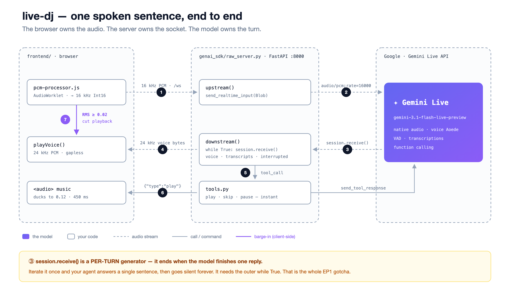

# EP1 · the raw `google-genai` build

No framework. One Gemini Live session per browser, two asyncio tasks, and the loop that every voice agent is made of.



The browser owns the audio (mic worklet down to 16 kHz, 24 kHz playback, barge-in). The server owns the socket — one `client.aio.live.connect()` session per browser. The model owns the turn.

## The two files that matter

| File | Lines | What it is |
|---|---|---|
| [`raw_minimal.py`](raw_minimal.py) | **39** | The entire primitive: open a session, send the mic, receive voice, play it. Nothing else. |
| [`raw_server.py`](raw_server.py) | 121 | The full app — the same loop plus Mira's persona, music tools, transcripts, and barge-in. |

Start with the minimal one. Everything that makes Mira *Mira* is the difference between those two files.

## The gotcha — why your voice agent goes silent after one sentence

`session.receive()` is a **per-turn** async generator. It ends the moment the model finishes one reply. Iterate it once and your agent answers exactly one sentence, then never speaks again:

```python
# ❌ one reply, then silence forever
async for response in session.receive():
    ...

# ✅ a conversation
while True:
    async for response in session.receive():
        ...
```

That's the bug this folder exists to show you. A coding agent writes the first version by default. The second one is in [`raw_minimal.py`](raw_minimal.py#L42).

Its sibling is [`gotcha_send_client_content.py`](gotcha_send_client_content.py): mic audio goes to `send_realtime_input`, **not** `send_client_content` — get that wrong and the model simply never hears you.

## Run it

From the repo root:

```bash
uv run uvicorn genai_sdk.raw_server:app --port 8000     # the full DJ
uv run uvicorn genai_sdk.raw_minimal:app --port 8000    # just the 39-line primitive
```

Open <http://localhost:8000>, headphones on, tap 🎙.

## What's inside

| | |
|---|---|
| `raw_server.py` | the raw Gemini Live loop + music-tool dispatch |
| `raw_minimal.py` | the 39-line voice-only extract |
| `tools.py` | `play_playlist` / `play_track` / `skip` / `pause` as JSON declarations + a dispatcher — they return **instantly**, so the voice never stalls |
| `persona.py` | wraps `../assets/mira_persona.txt` into the system instruction |
| `gotcha_send_client_content.py` | the wrong-way / right-way example |
